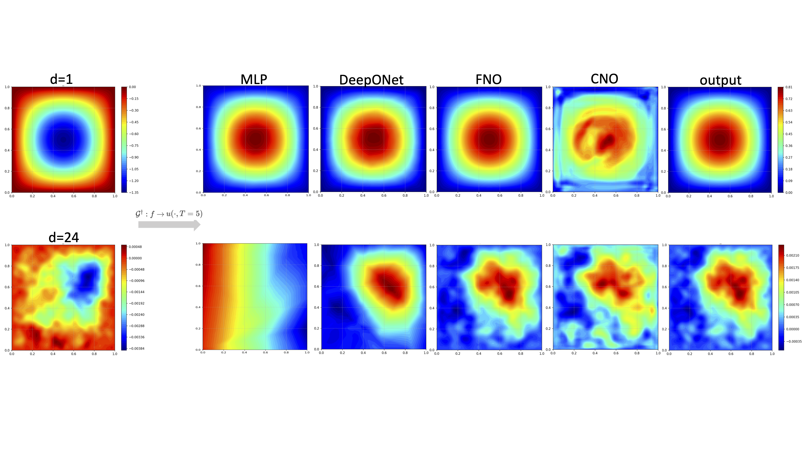

# Neural Operators and Operator Networks vs Parametric Approach
Course project for Deep Learning in Scientific Computing, part B.

:red_circle: **Please note that we didn't spend much time in doing the cross-validation and tuning the hyperparameters. The performance of the model can be further improved. And the comparision between these operator learning models may be different after careful tuning.**

## Dataset and Pretrained Model

Trainging dataset and pretrained model can be download from: [Google Drive](https://drive.google.com/drive/folders/10Gd3MewuWOAPsbBuI_5wk7qZVkuQ1sbj?usp=sharing)

Download dataset
```shell
pip install gdown
gdown --folder https://drive.google.com/drive/folders/1JF-n7P4qDN5yavN5mYIzkenFlO-_1LeX
```

Download pretrained model
```shell
gdown --folder https://drive.google.com/drive/folders/1bU_hRzUepsdoHk_DGk7zLfVnYJ4Jsl5E
```
## Heat Diffusion

### Problem Description

In this experiment, we discussed the two-dimensional parametric heat equation:
$$u_t=\Delta u, t \in[0,T],\ (x_1,x_2)\in[-1,1]^2,\mu\in[-1,1]^d$$

with the initial condition:
$$u(0,x_1,x_2,\mu)=u_0(x_1,x_2,\mu)=\frac{1}{d}\sum^d_{m=1}\sum^d_{m=1}u_0^m(x_1,x_2,\mu_m),$$

where $u_0^m(x_1,x_2,\mu_m)=-\mu_m\sin(\pi mx_1)\sin(\pi mx_2)/m^{0.5}$. The exact solution is given by:
$$u(t,x_1,x_2,\mu)=\frac{1}{d}\sum^d_{m=1}\sum^d_{m=1}u_0^m(x_1,x_2,\mu_m) e^{-2\pi^2m^2t}$$

In the following results we use speed of propagation $c=0.1$. **The objective is to approximate the operator**  ${\cal G}: u(0, \cdot, \cdot)\rightarrow u(T=0.01, \cdot, \cdot)$

### Training details
We generated 200 data sets with the resolution of $64\times 64$ for $d=1$ and $d=6$ based on analytical solution, where $T = 0.01$. We used 150 sets to train our models and 50 sets to test the performance, based on the mean l2 relative error. All the models are trained with Adam optimizer with learning rate of 0.001.

#### MLP

- A feedforward 4-layer multilayer perceptron with 150 neurons in each layer is chosen for the experiment
- The model was trained for 400-700 iterations

#### DeepONet

- The branch net is chosen as a fully connected neural network of size $[res \times res, 40, 40]$, and the trunk net is a fully connected neural network of size [2, 40, 40]
- The model was trained for 10000 iterations

#### FNO and CNO

- The lifting width for FNO is 32, and 4 Fourier layers are used. The number of nodes truncated for the Fourier node is 32. The final model parameters are chosen based on the best validation error. 
- For CNO, we used 6 layers. The kernel size and channel multiplier for convolution operation is 3 and 32, respectively. Upsampling coefficient for Relu activation is 2.
- The training epoch for FNO is 100 but 1000 for CNO.

### Results


### Resolution invariance
Furthermore, we test the resolution invariance of these models for different $d$. Similarly, we only use 150 training data to train the model and 50 data to test the model. We train the models on the resolution of $64\times 64$ and test the performance under different resolution. **Note, due to the longer training process, we didn't test the resolution invariance of CNO**

The following tables show the mean L2 relative error tested on different grid resolutions using the trained models

#### MLP


| resolution/d | 1          | 2          | 3           | 4           | 5           | 6           |
| ------------ | ---------- | ---------- | ----------- | ----------- | ----------- | ----------- |
| 32           | 7.1805     | 9.1301     | 11.9038     | 16.6792     | 44.4914     | 80.9182     |
| **64**       | **6.7095** | **8.7627** | **11.4965** | **16.0574** | **42.6141** | **79.6393** |
| 96           | 6.5696     | 8.6518     | 11.3748     | 15.8683     | 42.0200     | 79.2477     |
| 128          | 6.5024     | 8.5987     | 11.3161     | 15.7774     | 41.7287     | 79.0583     |


#### DeepOnet

| resolution\d | 1          | 2          | 3          | 4          | 5          | 6          |
| ------------ | ---------- | ---------- | ---------- | ---------- | ---------- | ---------- |
| 32           | 6.9410     | 4.7216     | 4.2353     | 4.8877     | 6.2910     | 5.4723     |
| **64**       | **4.7107** | **2.4742** | **2.5500** | **1.9887** | **2.7945** | **2.3586** |
| 96           | 4.4996     | 2.4901     | 2.8338     | 2.3045     | 2.7332     | 2.7789     |
| 128          | 4.3792     | 2.5635     | 2.9984     | 2.4686     | 2.6130     | 2.8031     |

#### FNO

| resolution\d | 1          | 2          | 3          | 4          | 5          | 6          |
| ------------ | ---------- | ---------- | ---------- | ---------- | ---------- | ---------- |
| 32           | 2.6700     | 4.4333     | 4.5112     | 4.7639     | 4.7230     | 4.6837     |
| **64**       | **1.9867** | **2.4443** | **2.6045** | **2.8313** | **2.9434** | **2.8752** |
| 96           | 1.9704     | 2.5296     | 2.6708     | 2.7527     | 2.9380     | 2.9412     |
| 128          | 1.9254     | 2.6723     | 2.8095     | 2.9824     | 3.0626     | 3.1439     |


- For MLP, we observe a fast drop of the performances of the model with increasing problem complexity as expected
- For FNO, we didn't see the distinguished alising effect. We believed it may be due to the lack of enough complexity in the task.


## Wave equation

### Problem Description

In this experiment, we discussed the a prototypical *linear hyperbolic PDE*, given as follows:
$$u_tt-c^2\Delta u=0,\ \text{in}\ D\times(0,T), u_0(x,y)=f(x,y)$$
with the initial condition of following form:

$$f(x,y)=\frac{\pi}{d^2}\sum^d_{i,j=1}a_{ij}\cdot(i^2+j^2)^{-r}\sin(\pi ix)\sin(\pi jy)$$

The exact solution at time $t>0$ is given by

$$u(x,y,t)=\frac{\pi}{d^2}\sum^d_{i,j=1}a_{ij}\cdot(i^2+j^2)^{-r}\sin(\pi ix)\sin(\pi jy)\cos(c\pi t\sqrt{i^2+j^2}),\ \forall(x,y)\in D$$

In the following results, we use $d=1, 24$ and $r=1$. The speed of propagation $c$ is set to 0.1. **The objective is to approximate the operator**  ${\cal G}: u(0, \cdot, \cdot) \rightarrow u(T=5, \cdot, \cdot)$

### Training details
We generated 640 data sets with the resolution of $64\times 64$ based on the exact solution. We used 512 data sets to train our model and 128 sets to test the performance of the model. 

The implemented MLP for the given wave equation has a larger network size, which contains 5 fully connected layers with 250 neurons in each layer. And the size of branch net in DeepONet is increased to $[64\times 64, 80, 80]$. For FNO and CNO, we used the same architecture but larger epoches to train the model. The rest of training settings are the same as those for heat equation. 

### Results




# Conclusions

For simple problems, both parametric approach and operator approach can approximate the solution of the PDE accurately. As the size of parameter space increases, MLP quickly fails to learn the mapping, while DeepONet can handle it to some extend, and the performance of FNO and CNO is barely affected.


___
