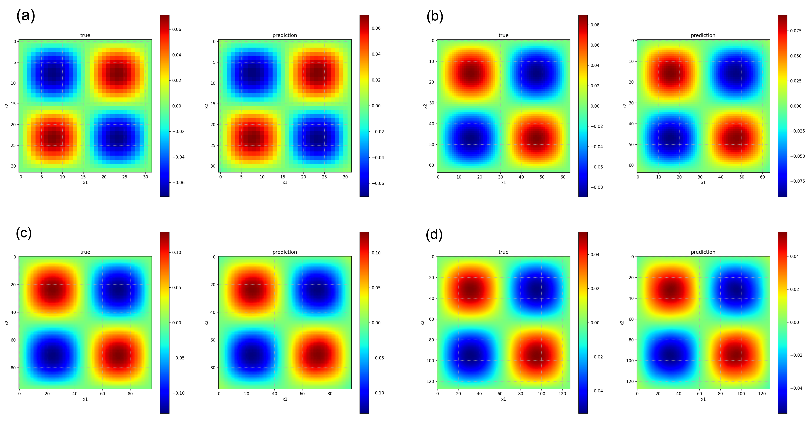
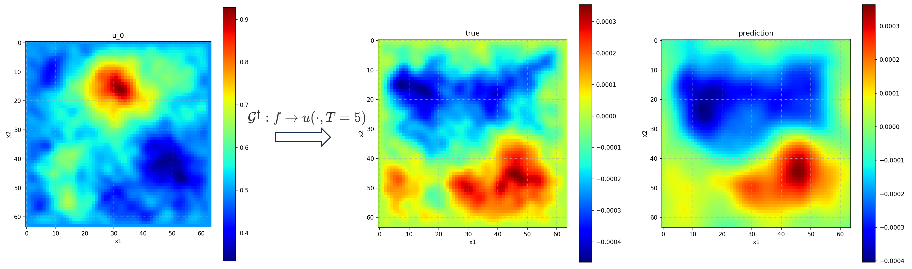

# DLSC_Project_B
Neural Operators and Operator Networks vs Parametric Approach

Trainging dataset and pretrained model can be download from: [Google Drive](https://drive.google.com/drive/folders/10Gd3MewuWOAPsbBuI_5wk7qZVkuQ1sbj?usp=sharing)

## Heat Diffusion
### Problem Description

#### FNO

We only use 150 training data to train the model. 50 data to test the model. We train the model on the resolution [64,64] and test it performance in different resolution.

| resolution\d | 1      | 2      | 3      | 4      | 5      | 6      |
| ------------ | ------ | ------ | ------ | ------ | ------ | ------ |
| 32           | 2.6700 | 4.4333 | 4.5112 | 4.7639 | 4.7230 | 4.6837 |
| 64           | 1.9867 | 2.4443 | 2.6045 | 2.8313 | 2.9434 | 2.8752 |
| 96           | 1.9704 | 2.5296 | 2.6708 | 2.7527 | 2.9380 | 2.9412 |
| 128          | 1.9254 | 2.6723 | 2.8095 | 2.9824 | 3.0626 | 3.1439 |

- It can be imagined that the effect of alising will become serious with increasing $d$。
- a very easy task.

## Wave equation

### Problem Description

In this experiment, we discussed the a prototypical *linear hyperbolic PDE*, given as follows:
$$
\begin{align}
u_tt-c^2\Delta u=0,\ \text{in}\ D\times(0,T), u_0(x,y)=f(x,y)
\end{align}
$$
If the initial condition has following forms:
$$
\begin{align}
f(x,y)=\frac{\pi}{K^2}\sum^K_{i,j=1}a_{ij}\cdot(i^2+j^2)^{-r}\sin(\pi ix)\sin(\pi jy)
\end{align}
$$

With $K=24$ and $r=1$. The exact solution at time $t>0$ is given by
$$
\begin{align}
u(x,y,t)=\frac{\pi}{K^2}\sum^K_{i,j=1}a_{ij}\cdot(i^2+j^2)^{-r}\sin(\pi ix)\sin(\pi jy)\cos(c\pi t\sqrt{i^2+j^2}),\ \forall(x,y)\in D
\end{align}
$$
speed of propagation $c=0.1$. **The objective is to approximate the operator**  $\cal{G}^\dagger:f\rightarrow$ $u(\cdot, T=5)$

### Training Process

512 training dataset and 128 test dataset. Trained on the resolution with 64$\times$64. The test error on 128 test dataset is 8.0658.

epoch: ~500

