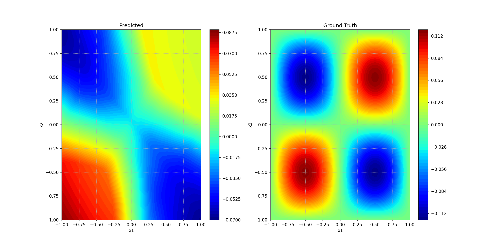
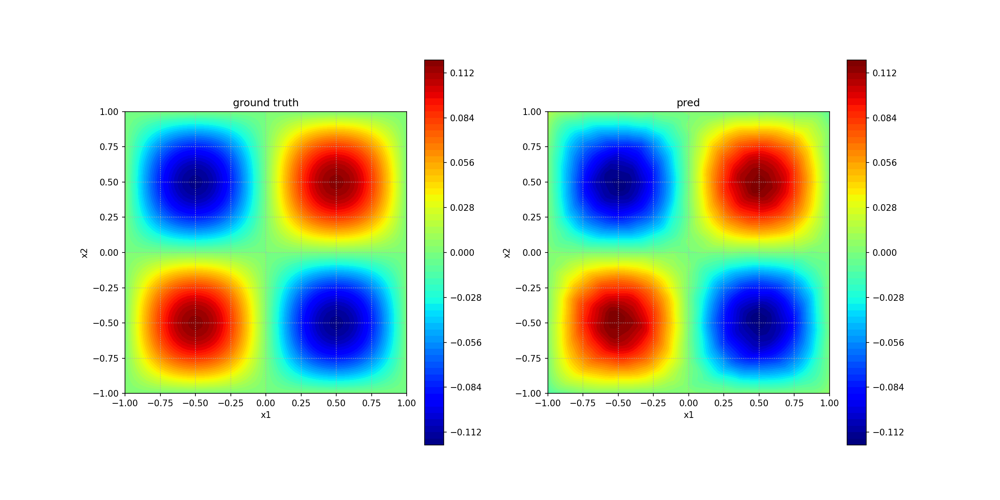

# DLSC_Project_B
Neural Operators and Operator Networks vs Parametric Approach

:red_circle: **Please note that we didn't spend much time in doing the cross-validation and tuning the hyperparameters. The performance of the model can be further improved. And the comparision between these operator learning models may be different after carefully tuning.**

## Dataset and Pretrained Model

Trainging dataset and pretrained model can be download from: [Google Drive](https://drive.google.com/drive/folders/10Gd3MewuWOAPsbBuI_5wk7qZVkuQ1sbj?usp=sharing)

Download dataset
```shell
pip install gdown
gdown --folder https://drive.google.com/drive/folders/1JF-n7P4qDN5yavN5mYIzkenFlO-_1LeX
```

Download pretrained model
```shell
gdown --folder https://drive.google.com/drive/folders/1bU_hRzUepsdoHk_DGk7zLfVnYJ4Jsl5E
```
## Heat Diffusion
### Problem Description

In this experiment, we discussed the two-dimensional parametric heat equation:
$$u_t=\Delta u, t \in[0,T],\ (x_1,x_2)\in[-1,1]^2,\mu\in[-1,1]^d$$
with the initial condition 


speed of propagation $c=0.1$. **The objective is to approximate the operator**  $\cal{G}^\dagger:f\rightarrow$ $u(\cdot, T=5)$

### Results
#### MLP
- A feedforward 4-layer multilayer perceptron with 150 neurons in each layer is chosen for the experiment
- The model was trained with Adam optimizer with a learning rate of 0.001 for 400-700 iterations
- The model was trained and tested on the dataset of size 150 and 50 respectively with resolution $64 \times 64$

| d | Comparison | Mean l2 relative error |
| :------------------: |:------------------: |:------------------: |
| d=1 |  | 6.7095 |
| d=2 |  | 8.7627 |
| d=3 |  | 11.4965 |
| d=4 |  | 16.0574 |
| d=5 |  | 42.6141 |
| d=6 |  | 79.6393 |

- We observe a fast drop of the performances of the model with increasing problem complexity as expected

#### DeepONet
- The branch net is chosen as a fully connected neural network of size $[res \times res, 40, 40]$, and the trunk net is a fully connected neural network of size [2, 40, 40]
- The model was trained with Adam and learning rate 0.001 for 10000 iterations
- It was trained and tested on the dataset with resolution $64 \times 64$, which is normalized based on its mean value and standard deviation during training.

| d | Comparison | Loss Plot | Mean l2 relative error |
| :------------------: |:------------------: |:------------------: |:------------------: |
| d=1 |  |  | 4.7107 |
| d=2 |  |  | 2.4742 |
| d=3 |  |  | 2.5499 |
| d=4 |  |  | 1.9887 |
| d=5 |  |  | 2.7945 |
| d=6 |  |  | 2.3586 |

#### FNO and CNO


- The dataset was generated with $d=6$ with resolution $64 \times 64$.
- For FNO and CNO, we used the same dataset with 150 training points and 50 test points.
- The training epoch for FNO is 100 but 1000 for CNO.
- The average error of FNO and CNO on test dataset is 2.8752 and 3.6586, respectively.


Further more, we test the resolution invariance of FNO for different $d$. Similarly, we only use 150 training data to train the model. 50 data to test the model. We train the model on the resolution $64\times 64$ and test it performance in different resolution. **Note, due to the longer training process, we didn't test the resolution invariance of CNO**

| resolution\d | 1      | 2      | 3      | 4      | 5      | 6      |
| ------------ | ------ | ------ | ------ | ------ | ------ | ------ |
| 32           | 2.6700 | 4.4333 | 4.5112 | 4.7639 | 4.7230 | 4.6837 |
| 64           | 1.9867 | 2.4443 | 2.6045 | 2.8313 | 2.9434 | 2.8752 |
| 96           | 1.9704 | 2.5296 | 2.6708 | 2.7527 | 2.9380 | 2.9412 |
| 128          | 1.9254 | 2.6723 | 2.8095 | 2.9824 | 3.0626 | 3.1439 |

- We show figure of the resolution invariance for $d=6$.


- It can be imagined that the effect of alising will become serious with increasing $d$。
- In this problem, we didn't see the distinguished alising effect. We believed it may be a very easy task.

## Wave equation

### Problem Description

In this experiment, we discussed the a prototypical *linear hyperbolic PDE*, given as follows:
$$u_tt-c^2\Delta u=0,\ \text{in}\ D\times(0,T), u_0(x,y)=f(x,y)$$
If the initial condition has following forms:

$$f(x,y)=\frac{\pi}{K^2}\sum^K_{i,j=1}a_{ij}\cdot(i^2+j^2)^{-r}\sin(\pi ix)\sin(\pi jy)$$

With $K=24$ and $r=1$. The exact solution at time $t>0$ is given by

$$u(x,y,t)=\frac{\pi}{K^2}\sum^K_{i,j=1}a_{ij}\cdot(i^2+j^2)^{-r}\sin(\pi ix)\sin(\pi jy)\cos(c\pi t\sqrt{i^2+j^2}),\ \forall(x,y)\in D$$

speed of propagation $c=0.1$. **The objective is to approximate the operator**  $\cal{G}^\dagger:f\rightarrow$ $u(\cdot, T=5)$

### Results
#### DeepONet
- The branch net is chosen as a fully connected neural network of size $[res \times res, 80, 80]$, and the trunk net is a fully connected neural network of size [2, 80, 80]
- The model was trained with Adam and learning rate 0.001 for 10000 iterations
- It was trained and tested on the dataset with resolution $64 \times 64$, which is normalized in the same way as for heat equation.

| Comparison | Loss Plot | Mean l2 relative error |
|:------------------: |:------------------: |:------------------: |
|  |  | 26.309 |

- Increasing the number of layers of the network helps a little bit, but not much. 
- After around 6000 iterations, there is not much improvement.

#### FNO and CNO


- 512 training dataset and 128 test dataset. Trained on the resolution with $64\times 64$. The test error of FNO on 128 test dataset is 8.0658 (~ 500 epochs). The error of CNO on 128 test dataset is 11.7288 (~ 400 epochs).


# Conclusions

- At least, we found that the CNO is not as easy to train as FNO. Often, we need more training epoches and careful tuning to achive the same performance.

## Q&A

1. Unable to run the GPU of the CNO on the cluster. `Ninja is required to load C++ extensions in Pycharm`
   - Solution: [CSDN](https://blog.csdn.net/Highlight_Jin/article/details/126070409?spm=1001.2101.3001.6650.6&utm_medium=distribute.pc_relevant.none-task-blog-2%7Edefault%7EBlogCommendFromBaidu%7ERate-6-126070409-blog-129278321.235%5Ev38%5Epc_relevant_anti_vip&depth_1-utm_source=distribute.pc_relevant.none-task-blog-2%7Edefault%7EBlogCommendFromBaidu%7ERate-6-126070409-blog-129278321.235%5Ev38%5Epc_relevant_anti_vip&utm_relevant_index=7)
